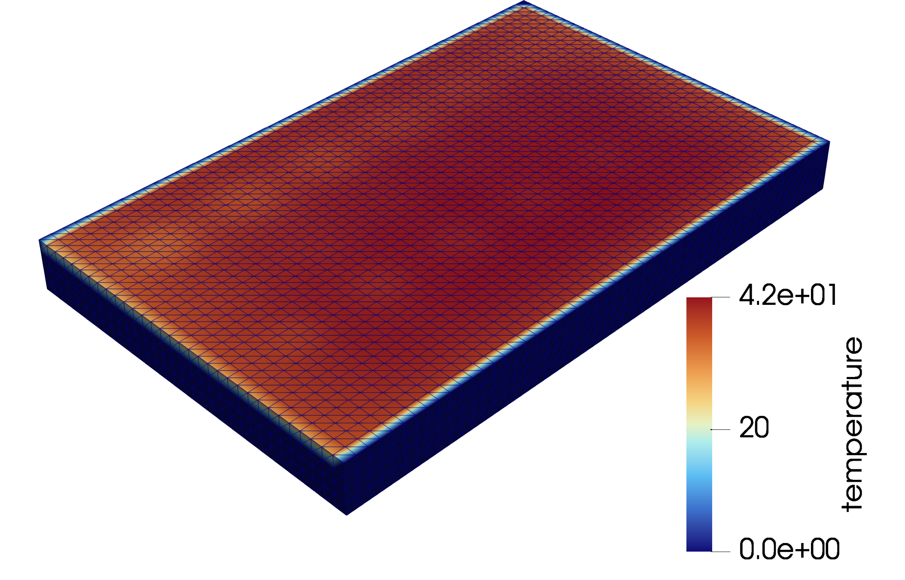

# ThermoSim

<p align="center">
  
</p>


<div align="center">

[](https://github.com/choROPeNt/ThermoSim)&nbsp;
[](https://choROPeNt.github.io/ThermoSim/)
[]()&nbsp;


</div>

## Getting Started

[Conda](https://docs.conda.io/en/latest/) is recommended for managing the environment.

**1. Create the environment**

```bash
conda env create -f environment.yml
```

**2. Activate the environment**

```bash
source ~/miniconda3/bin/activate
conda activate thermosim
```

**3. Update an existing environment**

```bash
conda env update -f environment.yml --prune
```


- 